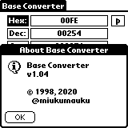

# BaseConv (PalmOS)

## About
BaseConv is a Base Converter application for PalmOS.

## Screenshots
### Modes
- Hex mode  

- Dec mode  

- Oct mode  

- Bin mode  

### Menus
- Base menu  

- Option menu  

### Dialogs
- About dialog  

## Build and Install
 Install prc-tools package, palm-sdk package, pilot-link package.
 Build with Makefile:
 $ make 
 You will get BaseConv.prc.
 
 Install with using pilot-link:
 $ pilot-xfer -p $(PALMUSBPORT) -i BaseConv.prc
 Push the HotSync button of your Palm cradle.

 PALMUSBPORT is a device file of usb port.
 ex. /dev/tty.usbserial-FTCURT8N 

## Usage
Command H: Change to hexdecimal input
Command D: Change to decimal input
Command O: Change to octal input
Command B: Change to binary input

[bs] button is backspace.
[cl] button is clear all.

## Files
- BaseConv.c (Main File)
- BaseConvRsc.h (Header File)
- BaseConv.prc (Palm Resource File)
- BaseConv.pbm (Normal Application Icon)
- BaseConvMini.pbm (Small Application Icon)
- Makefile (Make file)
- README.MD (This file)

